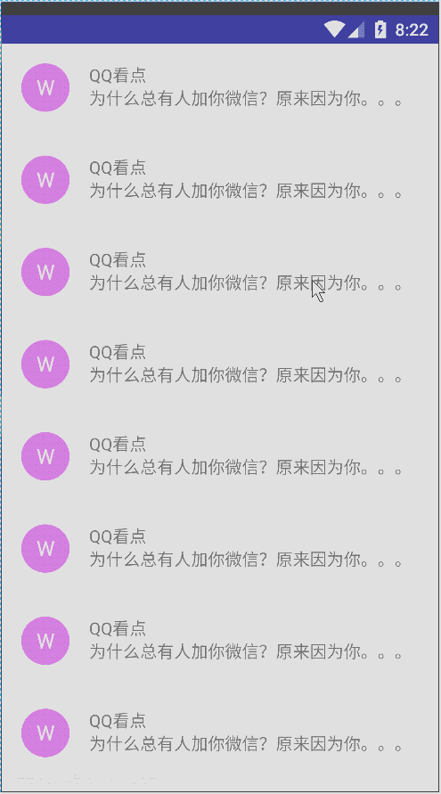
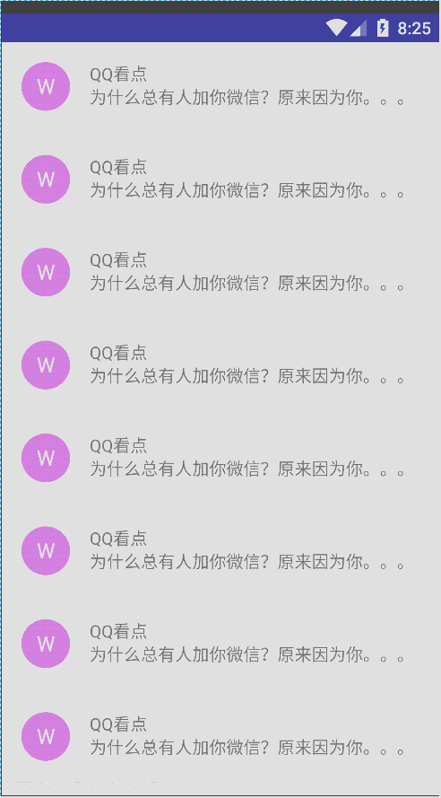

# SwipeLayout
一个侧滑容器，可以设置从左边、右边滑出

#### 子控件位置的指定
通过一下三个自定义属性指定mainView（主体控件）、leftView（左侧滑出控件）、rightView（右侧滑出控件）

```
        <attr name="mainViewIndex"
              format="integer"/>
        <attr name="leftViewIndex"
              format="integer"/>
        <attr name="rightViewIndex"
              format="integer"/>
```
其中指定的赋值为SwipeLayout的子控件在其中的位置（即是第几个子控件）。

#### 显示模式的配置
可通过自定义属性showMode配置:
```
          <attr name="show_mode"
              format="enum">
            <enum name="pull_out"
                  value="0"/>
            <enum name="lay_down"
                  value="1"/>
            <enum name="stretch"
                  value="2"/>
        </attr>
```

默认为pull_out,三种显示效果如下：
* pull_out



* lay_down


* stretch




#### SwipeLayout开启/关闭状态互斥问题

* 使用普通的ListView


* 使用SwipeListView


