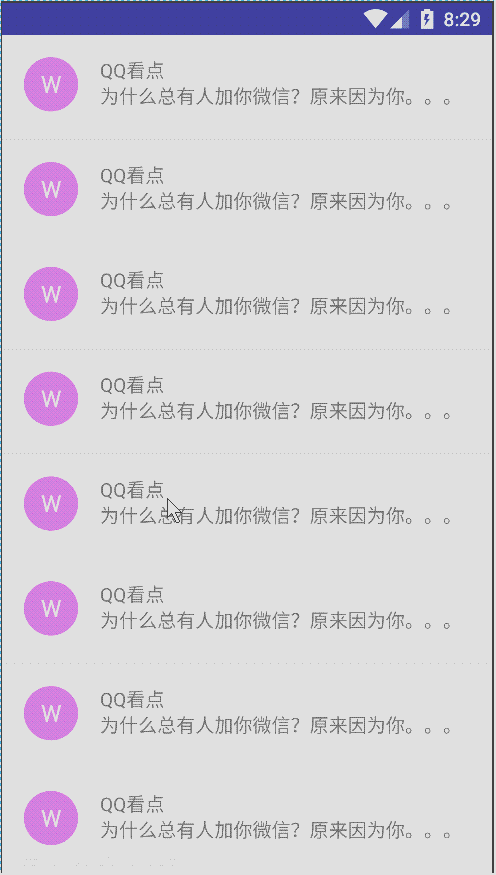
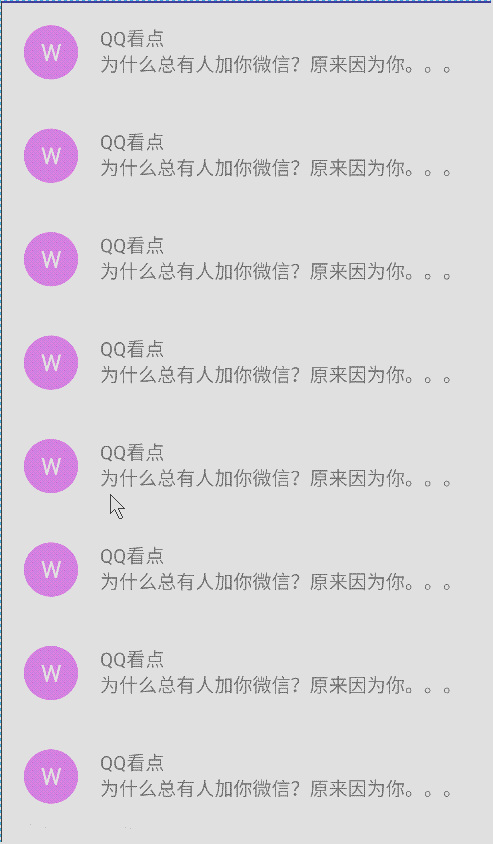

### 一、简单分析
SwipeLayout是一个侧滑容器，包括一个主体View和若干个侧滑View。如：QQ的侧滑效果。


初始化时，leftView、rightView都显示在屏幕外面，只能看到mainView。
当向右滑动屏幕时，leftView逐渐显示出来；当向左滑动时，rightView显示出来。

### 二、属性
在attrs.xml中有四个自定义属性。
```
<?xml version="1.0" encoding="utf-8"?>
<resources>
<declare-styleable name="SwipeLayout">
    <attr name="show_mode"
        format="enum">
        <enum name="pull_out"
            value="0"/>
        <enum name="lay_down"
            value="1"/>
        <enum name="stretch"
            value="2"/>
    </attr>
    <attr name="mainViewIndex"
        format="integer"/>
    <attr name="leftViewIndex"
        format="integer"/>
    <attr name="rightViewIndex"
        format="integer"/>
</declare-styleable>
</resources>
```
* mainViewIndex：用于指定SwipeLayout的第几个子控件为mainView。
* leftViewIndex：用于指定SwipeLayout的第几个子控件为leftView。
* rightViewIndex：用于指定SwipeLayout的第几个子控件为rightView。
* show_mode：用于指定leftView、rightView显示出来的方式，这里提供方了三种
1. pull_out：对应PullOutMode
2. lay_down：对应LayDownMode
3. strectch：对应StretchMode。
4. 如果需要实现其他效果，可以继承SwipeMode类来拓展。
5. 下面是三种显示方式的效果：
pull_out效果图：

lay_down效果图：

stretch效果图：


### 代码分析

    private void init(Context context, AttributeSet attrs) {
		TypedArray a = context.obtainStyledAttributes(attrs, R.styleable.SwipeLayout);
		int ordinal = a.getInt(R.styleable.SwipeLayout_show_mode, 0);
		switch (ordinal) {
			case 1:
				mSwipeMode = new LayDownMode(this);
				break;
			case 2:
				mSwipeMode = new StretchMode(this);
				break;
			default:
				mSwipeMode = new PullOutMode(this);
				break;
		}
		mainViewIndex = a.getInt(R.styleable.SwipeLayout_mainViewIndex, -1);
		leftViewIndex = a.getInt(R.styleable.SwipeLayout_leftViewIndex, -1);
		rightViewIndex = a.getInt(R.styleable.SwipeLayout_rightViewIndex, -1);
		a.recycle();
	}
主要做了两个事情：
* 获取在layout文件中设置的显示模式
* 获取在layout中配置的main、left、right三个控件分别制定哪个子控件。

    <?xml version="1.0" encoding="utf-8"?>
	<com.phone.swipelayout.SwipeLayout
	    xmlns:android="http://schemas.android.com/apk/res/android"
	    xmlns:phone="http://schemas.android.com/apk/res-auto"
	    android:layout_width="match_parent"
	    android:layout_height="wrap_content"
	    phone:leftViewIndex="0"
	    phone:mainViewIndex="2"
	    phone:rightViewIndex="1"
	    phone:show_mode="pull_out">
	
	    <include layout="@layout/left"/>
	
	    <include layout="@layout/right"/>
	
	    <include layout="@layout/main"/>
	
	</com.phone.swipelayout.SwipeLayout>

以上代码中指定显示模式为pull_out，即PullOutMode类实现。
第0、1、2个子控件分别为mainView、leftView、rightView。


    @Override
	public boolean onInterceptTouchEvent(MotionEvent event) {
		LogUtils.showW(TAG, "onInterceptTouchEvent", TAG_ENABLE);
		if (!mSwipeEnabled) {										//当
			return super.onInterceptTouchEvent(event);     
		}
		switch (event.getAction()) {
			case MotionEvent.ACTION_DOWN: {
				LogUtils.showV(TAG, "interceptTouchEvent  ACTION_DOWN", TAG_ENABLE);
				final int x = (int) event.getX();
				final int y = (int) event.getY();
				mLastMotionX = x;
				mLastMotionX = y;
				isIntercept = false;
				LogUtils.showD(TAG, "status:" + mStatus, TAG_ENABLE);
				break;
			}
			case MotionEvent.ACTION_MOVE: {
				LogUtils.showV(TAG, "interceptTouchEvent  ACTION_MOVE", TAG_ENABLE);
				final int x = (int) event.getX();
				final int y = (int) event.getY();
				final int xDiff = x - mLastMotionX;
				final int yDiff = y - mLastMotionY;
				mLastMotionX = x;
				mLastMotionY = y;

				if (Math.abs(xDiff) > mTouchSlop && Math.abs(xDiff) > Math.abs(yDiff)) {
					isIntercept = true;
					final ViewParent parent = getParent();
					if (parent != null) {
						parent.requestDisallowInterceptTouchEvent(true);
					}
				}
				break;
			}
			case MotionEvent.ACTION_UP:
			case MotionEvent.ACTION_CANCEL:
				final ViewParent parent = getParent();
				if (parent != null) {
					parent.requestDisallowInterceptTouchEvent(false);
				}
				if (mCurrentDragEdge == Left || mCurrentDragEdge == Right) {
					mLastMotionX = 0;
					mLastMotionY = 0;
				}
				break;
			default:
				break;
		}
		return isIntercept;
	}
在onInterceptTouchEvnet方法中move中判断手指滑动的方向，这里需要满足两个条件：
1. 是否大于系统默认的最小滑动距离
2. 横向滑动距离大于竖向滑动距离
只有满足以上两个条件，才能判定为横向滑动，并拦截事件交给自己的onTouchEvent处理。

    @Override
	public boolean onTouchEvent(MotionEvent event) {
		LogUtils.showW(TAG, "onTouchEvent", TAG_ENABLE);
		switch (event.getAction()) {
			case MotionEvent.ACTION_DOWN: {
				LogUtils.showV(TAG, "onTouchEvent  ACTION_DOWN", TAG_ENABLE);
				if (mMainView == null) {
					return false;
				}
				mFirstMotionX = (int) event.getX();
				mLastMotionX = mFirstMotionX;
				isFirstAction = false;
				break;
			}
			case MotionEvent.ACTION_MOVE: {
				LogUtils.showV(TAG, "onTouchEvent  ACTION_MOVE", TAG_ENABLE);
				final int x = (int) event.getX();
				final int xDiff = x - mLastMotionX;
				mLastMotionX = x;
				if (isFirstAction) {
					mFirstMotionX = (int) event.getX();
					isFirstAction = false;
				} else {
					determineWhichDrageEdge(x - mFirstMotionX);
					LogUtils.showD(TAG, "mIsBeingDragged:" + mIsBeingDragged, TAG_ENABLE);
					LogUtils.showD(TAG, "mCurrentDragEdge:" + mCurrentDragEdge, TAG_ENABLE);
					LogUtils.showD(TAG, "state:" + mStatus, TAG_ENABLE);
					if (mIsBeingDragged || mCurrentDragEdge != Empty) {
						//当可拖拽时进行偏移量累加
						checkOffset(xDiff);
						final ViewParent parent = getParent();
						if (parent != null) {
							parent.requestDisallowInterceptTouchEvent(true);
						}
						mSwipeMode.onPull();
						setStatus(Status.Middle);
						mSwipeMode.offsetLeftAndRight(mCurrentOffset);
					}
				}
				break;
			}
			case MotionEvent.ACTION_UP:
			case MotionEvent.ACTION_CANCEL: {
				LogUtils.showV(TAG, "onTouchEvent  ACTION_UP", TAG_ENABLE);
				final ViewParent parent = getParent();
				if (parent != null) {
					parent.requestDisallowInterceptTouchEvent(false);
				}
				if (mCurrentDragEdge != DragEdge.Empty) {
					mSwipeMode.onRelease();
				}
				mLastMotionX = 0;
				mLastMotionY = 0;
				mFirstMotionX = 0;
				mIsBeingDragged = false;
				isFirstAction = true;
			}
			default:
				break;
		}
		return super.onTouchEvent(event) || mIsBeingDragged || event.getAction() == MotionEvent.ACTION_DOWN;
	}

在onTouchEvnet方法中，
* down事件必须处理。
* move事件中，根据手指滑动的距离，判断当前操作的侧边控件（leftView、rihgtViwe或者没有），并校验滑动的距离。最后传递偏移值给SwipeMode具体的示例去自己处理。这里既是三种显示模式。mSwipeMode.onPull();
* up事件中实现动画。mSwipeMode.onRelease();

#### SwipeLayout开启/关闭状态互斥问题

* 使用普通的ListView



* 使用SwipeListView




